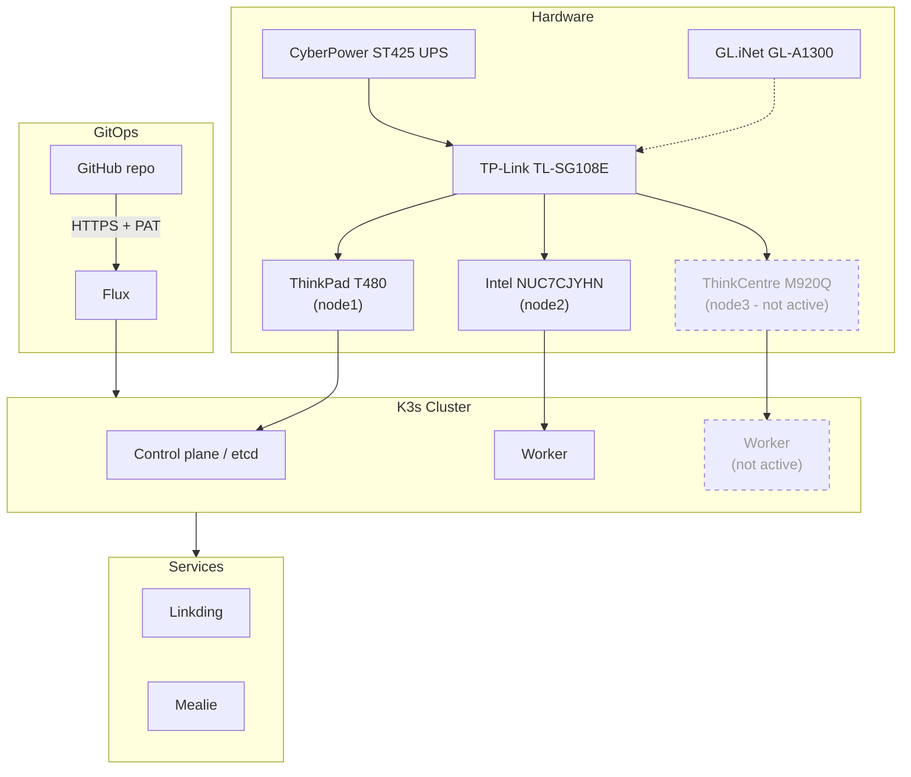

# Homelab - Beyond the Certifications

## Introduction
After obtaining my RHCSA and RHCE, I realized quickly that even though certifications are helpful, what matters the most is what you do beyond the certifications.

This repo contains all of the configuration and documentation of my homelab. 

My homelab is the place where I can try out and learn new things.

In addition, by self-hosting applications, it makes me feel responsible for the entire process of deploying and maintaining an application from A to Z. It forces me to think about backup strategies, security, scalability and the ease of deployment and maintenance.

## Architecture Overview
> **Status:** Planned target architecture. The M920Q arrived September 8, 2026 and has not yet been imaged/joined to the cluster — currently running on 2 nodes (T480 + NUC). Diagram reflects the intended 3-node HA state once M920Q setup is complete.


## Hardware
I decided to use a combination of an old laptop and old mini computers because they are affordable, reliable, and compact since I travel a lot for work. In addition, I wanted to a combination of bare-metal with a hypervisor-virtualized in my cluster.
- Lenovo ThinkPad T480 (i7-8650U/24GB/512GB) — Fedora Workstation 44, primary node
- Intel NUC7CJYHN (J4025/16GB/256GB) — Proxmox VE + Fedora Server 44
- Lenovo ThinkCentre M920Q (i7-8700T/16GB/512GB) — 3rd node, HA etcd quorum
- GL.iNet GL-A1300 — travel/VPN router
- TP-Link TL-SG108E — managed switch
- CyberPower ST425 — UPS

## Software Stack
- OS: Fedora
- Orchestration: K3s
- GitOps: Flux (HTTPS/PAT auth)
- Networking: LoadBalancer/Ingress not configured yet. Services are accessed via port-forwarding.

## Deployed Services
| Service | Purpose | Status |
|---|---|---|
| Linkding | Bookmark manager | Live |
| Mealie | Recipe/meal planning | Live |

## Repo Structure
I decided to use Flux's recommended repository structure
```
├── apps
│   ├── base
│   │   └── linkding
│   │       ├── deployment.yaml
│   │       ├── kustomization.yaml
│   │       ├── namespace.yaml
│   │       └── storage.yaml
│   └── staging
│       └── linkding
│           └── kustomization.yaml
├── clusters
│   └── staging
│       ├── apps.yaml
│       └── flux-system
│           ├── gotk-components.yaml
│           ├── gotk-sync.yaml
│           └── kustomization.yaml
```

## Lessons Learned / Troubleshooting
**Flux failed to reconcile: `apiVersion: app/v1` → should be `apps/v1`**
There was a typo in the Linkding deployment manifest. Flux silently failed reconciliation with no clear error until I checked `flux get kustomizations` output. This showed me how important syntax and formatting is within each file because `yamllint` did not detect it as an error.

**PVC YAML structure error**
Malformed `persistentVolumeClaim` volume definition blocked the Linkding pod from scheduling. By not ensuring that the names of the volume blocks matched, Flux did not reconcile and apply my changes. This taught me to use logical names for each section to avoid confusion.

**SSH auth failures across chezmoi, Flux, and DevPod**
I experienced consistent failures in my containerized/constrained environments, so I switched to HTTPS + GitHub PAT everywhere as the reliable default.

**KUBECONFIG pointing at root-owned kubeconfig**
My `kubectl` commands failed with permission errors after I moved my cluster from being hosted through Rancher on my iMac to my T480 with K3s because it defaulted to `/etc/rancher/k3s/k3s.yaml` instead of `~/.kube/config`. To avoid this again, I made sure I added it to my dot_zshrc file that is managed by Chezmoi + Mise.

**SELinux blocking DevPod workspace directories on Fedora**
I originally configured my DevPod on Ubuntu; however, once I switched my OS to Fedora, I ran into permission errors on workspace mounts. To fix this I had to utilize `semanage`/`restorecon` to set `container_file_t` context instead of `user_file_t` because I did not want to run `setenforce 0`.

## Roadmap
| Category | Task | Status | Date |
|---|---|---|---|
| Homelab | Join M920Q as 3rd node for HA etcd quorum | Pending | |
| Homelab | Expose Linkding to the internet | Pending | |
| Homelab | Set up Ingress with Traefik | Pending | |
| Homelab | Configure secrets management (Azure Key Vault sync) | Pending | |
| Homelab | Add monitoring stack via Helm | Pending | |
| Homelab | Automate image updates (Flux image automation) | Pending | |
| Cloud & IaC | Stand up Terraform-managed repo/Azure foundation | Pending | |
| Cloud & IaC | Learn IaC fundamentals and Terraform modules | Pending | |
| Cloud & IaC | Provision Azure Kubernetes Service (AKS) with Terraform | Pending | |
| Application & Database | Deploy n8n and expose it publicly | Pending | |
| Application & Database | Deploy Postgres and connect n8n to it | Pending | |
| Application & Database | Explore running databases in Kubernetes (CloudNativePG) | Pending | |
| Application & Database | Configure and test CNPG backup/restore workflows | Pending | |
| Production Readiness | Harden AKS cluster access and apply operational best practices | Pending | |
| Production Readiness | Deploy a production-grade application with production-grade monitoring | Pending | |
| Production Readiness | Handle staging environment fixes and production cluster/customer onboarding | Pending | |
| GitOps | Extend Flux GitOps patterns across staging and production environments | Pending | |
| Networking | Segment network on 802.1Q VLAN 10 for security isolation | Pending | |