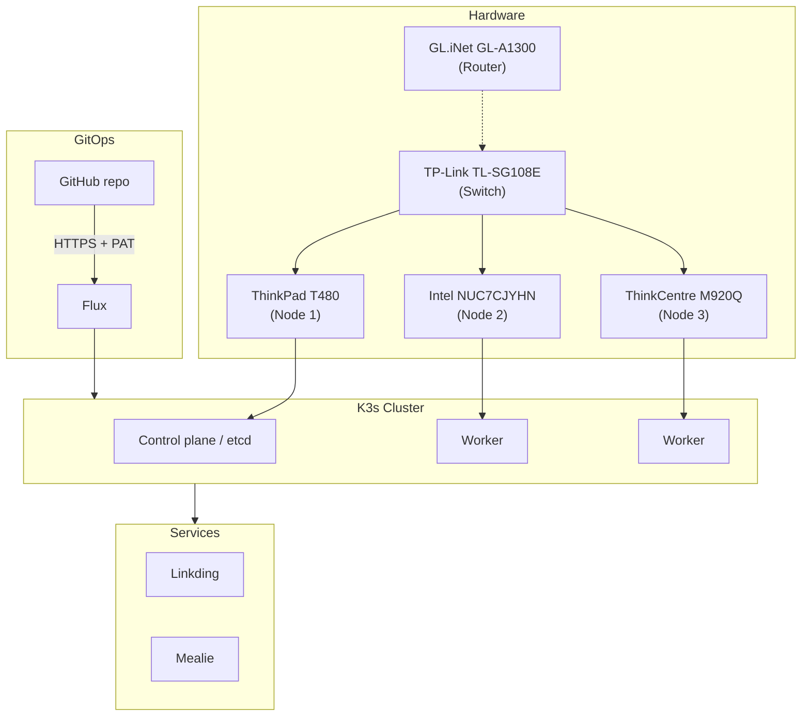

<div align="center">

# Homelab - Beyond the Certifications

</div>

## Introduction
After obtaining my RHCSA and RHCE, I realized quickly that even though certifications are helpful, what matters the most is what you do beyond the certifications.

This repo contains all of the configuration and documentation of my homelab. 

My homelab is the place where I can try out and learn new things.

In addition, by self-hosting applications, it makes me feel responsible for the entire process of deploying and maintaining an application from A to Z. It forces me to think about backup strategies, security, scalability and the ease of deployment and maintenance.

## Architecture Overview


```mermaid
flowchart TB
    subgraph HW["Hardware"]
        SW["TP-Link TL-SG108E
        (Switch)"]
        RTR["GL.iNet GL-A1300
        (Router)"]
        T480["ThinkPad T480
        (Node 1)"]
        NUC["Intel NUC7CJYHN
        (Node 2)"]
        M920["ThinkCentre M920Q
        (Node 3)"]
        SW --> T480
        SW --> NUC
        SW --> M920
        RTR -.-> SW
    end

    subgraph K3S["K3s Cluster"]
        CTRL[Control plane / etcd]
        WRK1[Worker]
        WRK2[Worker]
    end

    T480 --> CTRL
    NUC --> WRK1
    M920 --> WRK2

    subgraph GITOPS["GitOps"]
        GH[GitHub repo] -->|HTTPS + PAT| FLUX[Flux]
    end

    FLUX --> K3S

    subgraph SVC["Services"]
        LD[Linkding]
        ML[Mealie]
    end

    K3S --> SVC
```

## Hardware
I decided to use a combination of an old laptop and old mini computers because they are affordable, reliable, and compact since I travel a lot for work. In addition, I wanted to a combination of bare-metal with a hypervisor-virtualized in my cluster.
- Lenovo ThinkPad T480 (i7-8650U/24GB/512GB) — Fedora Workstation 44, primary node
- Intel NUC7CJYHN (J4025/16GB/256GB) — Proxmox VE + Fedora Server 44, second node
- Lenovo ThinkCentre M920Q (i7-8700T/16GB/512GB) — Fedora Server 44, third node
- GL.iNet GL-A1300 — travel/VPN router
- TP-Link TL-SG108E — managed switch
- CyberPower ST425 — UPS

## Software Stack
- OS: Fedora
- Orchestration: K3s
- GitOps: Flux (HTTPS/PAT auth)
- Networking: LoadBalancer/Ingress not configured yet. Services are accessed via port-forwarding.

<div align="center">

### VLAN 1 Configuration - Personal
| Device | IP |
|---|---|
| TL-SG108E Switch | .5 |
| GL-A1300 (VLAN 1 Gateway) | .8 |
| T480 (node) | .51 |
| DHCP (personal devices) | .100-.200 |

### VLAN 10 Configuration - Cluster
| Device | IP |
|---|---|
| GL-A1300 (VLAN 10 Gateway) | .1 |
| Promox Host Management | .5 |
| K3s VIP (kube-vip) | .10 |
| T480 (node1, control) | .11 |
| NUC (node2) | .12 |
| M920Q (node3) | .13 |

</div>

## Deployed Services

<div align="center">

| Service | Purpose | Status |
|---|---|---|
| Linkding | Bookmark manager | Live |
| Mealie | Recipe/meal planning | Not Live |

</div>

## Repo Structure
I decided to use Flux's recommended repository structure
```
├── apps
│   ├── base
│   │   └── linkding
│   │       ├── deployment.yaml
│   │       ├── kustomization.yaml
│   │       ├── namespace.yaml
│   │       └── storage.yaml
│   └── staging
│       └── linkding
│           └── kustomization.yaml
├── clusters
│   └── staging
│       ├── apps.yaml
│       ├── flux-system
│       │   ├── gotk-components.yaml
│       │   ├── gotk-sync.yaml
│       │   └── kustomization.yaml
│       └── infrastructure.yaml
├── infrastructure
│   ├── base
│   │   └── kube-vip
│   │       ├── daemonset.yaml
│   │       ├── kustomization.yaml
│   │       └── rbac.yaml
│   └── staging
│       └── kube-vip
│           └── kustomization.yaml
```

## Roadmap
| Category | Task | Status | Date |
|---|---|---|---|
| Network | Segment network on 802.1Q VLAN 10 trunk for security isolation | Done | 09/16/26 |
| Homelab | Join M920Q as 3rd node for HA etcd quorum | Done | 09/27/26 |
| Homelab | Expose Linkding to the internet | Pending | |
| Homelab | Set up Ingress with Traefik | Pending | |
| Homelab | Configure secrets management (Azure Key Vault sync) | Pending | |
| Homelab | Add monitoring stack via Helm | Pending | |
| Homelab | Automate image updates (Flux image automation) | Pending | |
| Cloud & IaC | Stand up Terraform-managed repo/Azure foundation | Pending | |
| Cloud & IaC | Learn IaC fundamentals and Terraform modules | Pending | |
| Cloud & IaC | Provision Azure Kubernetes Service (AKS) with Terraform | Pending | |
| Application & Database | Deploy n8n and expose it publicly | Pending | |
| Application & Database | Deploy Postgres and connect n8n to it | Pending | |
| Application & Database | Explore running databases in Kubernetes (CloudNativePG) | Pending | |
| Application & Database | Configure and test CNPG backup/restore workflows | Pending | |
| Production Readiness | Harden AKS cluster access and apply operational best practices | Pending | |
| Production Readiness | Deploy a production-grade application with production-grade monitoring | Pending | |
| Production Readiness | Handle staging environment fixes and production cluster/customer onboarding | Pending | |
| GitOps | Extend Flux GitOps patterns across staging and production environments | Pending | |

## Lessons Learned / Troubleshooting

<details>
<summary><strong>Flux silently failed on a typo: <code>app/v1</code> instead of <code>apps/v1</code></strong></summary>

A typo in the Linkding deployment manifest (`apiVersion: app/v1`) made Flux fail reconciliation with no clear error. I only found it by checking `flux get kustomizations`. `yamllint` did not flag it.

**Fix:** corrected the value to `apps/v1`.
</details>

<details>
<summary><strong>PVC volume definition errors blocked pod scheduling</strong></summary>

A malformed `persistentVolumeClaim` volume definition kept the Linkding pod from scheduling. The names of the volume blocks did not match, so Flux never reconciled or applied my changes.

**Fix:** aligned the volume names across the manifest sections.
</details>

<details>
<summary><strong>SSH auth failures across chezmoi, Flux, and DevPod</strong></summary>

SSH authentication failed consistently in my containerized and constrained environments.

**Fix:** switched to HTTPS + GitHub PAT everywhere.
</details>

<details>
<summary><strong>KUBECONFIG defaulting to a root-owned kubeconfig</strong></summary>

After I moved the cluster from Rancher on my iMac to K3s on my T480, `kubectl` commands failed with permission errors because they defaulted to `/etc/rancher/k3s/k3s.yaml` instead of `~/.kube/config`.

**Fix:** set `KUBECONFIG` in my `dot_zshrc`, which is managed by Chezmoi + Mise.
</details>

<details>
<summary><strong>SELinux blocking DevPod workspace mounts on Fedora</strong></summary>

DevPod worked when I ran it on Ubuntu. After I switched to Fedora, workspace mounts hit permission errors from SELinux.

**Fix:** used `semanage` and `restorecon` to set the `container_file_t` context instead of `user_file_t`, rather than running `setenforce 0`.
</details>

<details>
<summary><strong>VLAN segmentation surfaces silent firewall blocks</strong></summary>

Segmenting K3s nodes onto their own VLAN (isolated from the home network) exposed that Fedora's `firewalld` was blocking inter-node etcd traffic by default. The symptom was a 13+ minute hang on server join with `etcd: request timed out`, which is not an obvious firewall error.

**Fix:** explicitly open K3s's required ports on every server node:
- `6443/tcp` — API server
- `2379-2380/tcp` — etcd client/peer
- `8472/udp` — flannel VXLAN overlay
- `10250/tcp` — kubelet API
</details>

<details>
<summary><strong>Failed etcd joins leave stale state on the leader, not just the joining node</strong></summary>

A join attempt that fails partway (e.g. due to the firewall issue above) can register the joining node as an etcd learner on the *leader* before failing. Simply wiping the failed node (`k3s-uninstall.sh`) and retrying is not enough because the leader still holds a stale learner entry and rejects the retry with `duplicate node name found`.

**Fix:** on the leader, remove the stale member directly via `etcdctl member remove <id>`, and also check for/delete a leftover `<node>.node-password.k3s` secret in `kube-system` — K3s tracks node identity separately from etcd membership, and either one alone can cause a collision.
</details>

<details>
<summary><strong>kube-vip as a static pod is a single point of failure for HA</strong></summary>

I initially deployed kube-vip as a single static pod manifest on one control-plane node. This "worked" until that specific node went down, then the VIP went down with it, defeating the purpose of HA.

**Fix:** deploy kube-vip as a DaemonSet across all control-plane nodes (with RBAC for leader election), so any surviving node can claim the VIP via `vip_leaderelection`.
</details>

<details>
<summary><strong>A wiped node is not just a K3s problem — it can take Flux down too</strong></summary>

Resetting the control-plane node (`k3s-uninstall.sh`) during the VLAN migration also wiped Flux's CRDs, controllers, and git auth secret, since they were running as in-cluster resources. This was not obvious until `flux get kustomizations` failed with a missing-API-resource error days later.

**Fix:** since the bootstrap manifests (`gotk-components.yaml`, `gotk-sync.yaml`) were already committed to git, recovery was a straight `kubectl apply` of both — no new GitHub token needed unless the auth secret itself was also lost (it was, and had to be recreated with `flux create secret git`).
</details>

<details>
<summary><strong>Token rotation does not propagate automatically</strong></summary>

I wanted to learn how to rotate a token in the event that one needed to be changed.  Running `k3s token rotate` on the server only generates a new token, it does not update the token stored locally on any node (`/etc/systemd/system/k3s.service.env`).

**Fix:** manually update the token in each node's env file and restart k3s one node at a time, confirming quorum is maintained (2-of-3 minimum) before moving to the next.
</details>